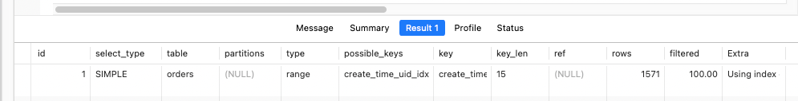
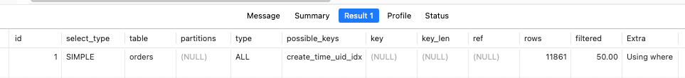

::: tip
在校招和初级岗位的面试中使用该案例会很有效果，但是整体来说它是一个简单的案例，所以面一些比较高端的岗位的时候，它并不能为你赢得竞争优势。

这个案例可以作为你排查数据库性能问题的案例，也可以作为性能优化的案例。
:::

**内容** <br/>
索引失效有很多种可能，你可以从这个问题里面[为什么定义了索引，但是最终数据库却没有用上？](https://github.com/hhhbx/HaiTang-Lab/blob/main/docs/notes/theme/interview/x-interview4.md)找到详细的描述，这个案例描述的是在一些特定的场景下，MySQL 会放弃使用索引，选择使用全表扫描。 就弃用索引选择全表扫描而言，MySQL 本身自认为是做了一个合理的决策，但是实际中可能 MySQL 的这个决策可能效果并不是很好。在这个案例里面我们通过构造 WHERE 查询，导致 MySQL 判定候选的数据非常多，从而放弃使用索引，转而使用全表扫描。

其实整个案例非常简单。如果你执行这个 SQL：

  ```sql
  select * from `orders` where uid = 123 and create_time > '2024-10-25 18:47:59';
  ```
执行 EXPLAIN 命令，你会发现它会使用索引：

而后如果你执行这个 SQL：

  ```sql
    select * from `orders` where uid = 123 and create_time > '2024-09-13 18:47:59';
  ```
执行 EXPLAIN 命令，你会发现它不会使用索引：

而这两个查询唯一不同的就是查询条件。第一个 SQL 命中少量的数据，而第二个 SQL 会命中大量的 SQL，这导致 MySQL 认为执行全表扫描性能会更好。

**适用场景和话术**<br/>
在讨论到性能优化和 MySQL 的时候，你都可以考虑使用这个案例，例如这些问题：

你做过什么性能优化？
- 你有没有遇到过全表扫描的问题？怎么解决的？
- 定义了索引以后，MySQL 查询一定会用索引吗？
- 为什么明明有索引，但是 MySQL 还是使用了全表扫描？<br/><br/>

在面试中使用这个案例的时候，可以参考这个话术来，要点是在于指出引起这个全表扫描的原因和对应的解决方案：

我之前就遇到过一个全表扫描的问题。<br/>
简单来说，我们有一个范围查询，偶尔会非常慢。后来我通过日志发现，当查询条件比较宽泛的时候，就会出现查询非常慢的情况。<br/>
这时候我就怀疑可能是因为查询条件没什么过滤的效果，导致 MySQL 认为使用全表查询会更好。<br/>
因此我拿到这个查询，并且用同样的条件，用 EXPLAIN 看了一下，果然这个时候就发现这个查询是真的没有用索引。<br/>
那么解决思路也很简单，就是可以通过 FOR INDEX 来确保查询一定会使用索引。<br/>
你要额外小心一点，面试官可能会问你 EXPLAIN 命令的细节，你最好就是自己实际中真的使用一下 EXPALIN。<br/><br/>

注意：这个案例并不稳定，也就是有时候你可能看到它确实用了索引，有时候它又没有使用索引，这主要是因为 MySQL 判定机制就是一个综合的复杂的机制，所以可能会出现这种问题。但是经过我们的测试，大多数时候你都能看到它使用全表扫描。

- 引导点： EXPLAIN命令；
- 速记点： 范围查询过滤差，全表查询难避免；
- 亮 点： 优化全表扫描

**好的，我们来详细讲解一下 `EXPLAIN` 命令的细节，以及如何利用它来分析和优化 SQL 查询。**
**什么是 EXPLAIN 命令？**
`EXPLAIN` 命令是 MySQL 提供的一个非常有用的工具，它可以让你了解 MySQL 如何执行 SQL 查询。通过 `EXPLAIN` 命令，你可以看到查询的执行计划，包括是否使用了索引、使用了哪种类型的索引、扫描了多少行数据等等。这些信息对于分析查询性能瓶颈、优化 SQL 查询非常有帮助。

## 如何使用 EXPLAIN 命令？

使用 `EXPLAIN` 命令非常简单，只需要在 SQL 查询语句前面加上 `EXPLAIN` 关键字即可。例如：

```sql
EXPLAIN SELECT * FROM users WHERE id > 10;
```

执行以上命令后，MySQL 会返回一个结果集，包含查询的执行计划。

**EXPLAIN 命令返回的列**

`EXPLAIN` 命令返回的结果集包含多列，每一列都代表了查询执行计划的不同方面。下面是 `EXPLAIN` 命令返回的常用列：

* **id：** 查询的标识符。如果查询包含子查询，则每个子查询都会有一个单独的 id。
* **select_type：** 查询的类型。常见的类型包括 SIMPLE（简单查询）、PRIMARY（主查询）、SUBQUERY（子查询）、DERIVED（派生表）等。
* **table：** 查询访问的表。
* **partitions：** 查询访问的分区。
* **type：** 连接类型。表示 MySQL 如何查找表中的行。常见的类型包括：
  * **SYSTEM：** 表中只有一行数据，通常用于系统表。
  * **CONST：** MySQL 可以通过常数来优化查询，例如查询主键或唯一索引。
  * **EQ_REF：** 使用唯一索引或主键索引进行查找。
  * **REF：** 使用非唯一索引进行查找。
  * **FULLTEXT：** 使用全文索引进行查找。
  * **RANGE：** 使用索引进行范围查找。
  * **INDEX：** 全索引扫描。
  * **ALL：** 全表扫描。
* **possible_keys：** 可能用于查询的索引。
* **key：** 实际使用的索引。
* **key_len：** 使用的索引长度。
* **ref：** 与索引列进行比较的常量或列。
* **rows：** 估计需要扫描的行数。
* **filtered：** 过滤的行数百分比。
* **Extra：** 包含不适合在其他列中显示的额外信息。

**如何分析 EXPLAIN 命令的结果？**

通过分析 `EXPLAIN` 命令返回的结果，你可以了解查询的执行计划，从而找到查询性能瓶颈。以下是一些常见的分析技巧：

* **关注 type 列：** `type` 列表示连接类型，它的值越好，查询性能就越高。一般来说，`type` 列的值应该在 `EQ_REF`、`REF`、`RANGE` 之间。如果 `type` 列的值是 `INDEX` 或 `ALL`，则表示查询使用了全索引扫描或全表扫描，这通常是查询性能瓶颈。
* **关注 key 列：** `key` 列表示实际使用的索引。如果 `key` 列的值为空，则表示查询没有使用索引，这通常是查询性能瓶颈。
* **关注 rows 列：** `rows` 列表示估计需要扫描的行数。`rows` 列的值越小，查询性能就越高。
* **关注 Extra 列：** `Extra` 列包含一些额外的信息，例如是否使用了临时表、是否使用了文件排序等。这些信息可以帮助你更深入地了解查询的执行计划。

## 如何优化 SQL 查询？

通过 `EXPLAIN` 命令分析查询执行计划后，你可以根据分析结果来优化 SQL 查询。以下是一些常见的优化技巧：

* **添加索引：** 如果查询没有使用索引，或者使用了全索引扫描或全表扫描，则可以考虑添加索引来提高查询性能。
* **优化索引：** 如果查询使用了索引，但是索引效率不高，则可以考虑优化索引，例如调整索引列的顺序、添加覆盖索引等。
* **重写 SQL 查询：** 有时候，SQL 查询的写法不够优化，可以尝试重写 SQL 查询来提高查询性能。

## 总结

`EXPLAIN` 命令是 MySQL 提供的一个非常有用的工具，它可以让你了解 MySQL 如何执行 SQL 查询。通过 `EXPLAIN` 命令，你可以分析查询性能瓶颈，并根据分析结果来优化 SQL 查询。掌握 `EXPLAIN` 命令的使用，对于提高 SQL 查询性能非常有帮助。

希望以上信息对您有所帮助！如果您有任何问题，欢迎随时提出。

**好的，我们来详细讲解一下如何通过 `FOR INDEX` 来确保查询一定会使用索引。**

**为什么需要强制使用索引？**

MySQL 查询优化器会根据查询条件、数据量等因素，自动选择合适的索引来执行查询。但是，在某些情况下，优化器可能会选择不使用索引，或者选择了效率较低的索引，导致查询性能下降。这时，我们可以通过 `FOR INDEX` 来强制 MySQL 使用指定的索引，以提高查询性能。

## 如何使用 FOR INDEX？

`FOR INDEX` 语法非常简单，只需要在 SQL 查询语句中的 `FROM` 子句后面加上 `FOR INDEX (index_name)` 即可。其中，`index_name` 是你要强制使用的索引名称。例如：

```sql
SELECT * FROM users FOR INDEX (idx_name) WHERE id > 10;
```

以上 SQL 查询语句会强制 MySQL 使用名为 `idx_name` 的索引来查询 `users` 表中 `id` 大于 10 的数据。

##  使用 FOR INDEX 的注意事项

* **确保索引存在：** 在使用 `FOR INDEX` 之前，必须确保指定的索引已经存在。
* **选择合适的索引：** 选择合适的索引对于提高查询性能非常重要。如果选择了不合适的索引，可能会导致查询性能更差。
* **了解索引的局限性：** 索引并不是万能的。在某些情况下，即使使用了索引，查询性能也可能无法达到预期。
* **谨慎使用：** 强制使用索引可能会导致查询性能下降，因此应该谨慎使用。只有在确定优化器选择的索引不合适时，才应该考虑使用 `FOR INDEX`。

## 示例

假设我们有一个名为 `orders` 的表，其中包含 `order_id`、`user_id`、`order_date` 等字段。我们在 `user_id` 字段上创建了一个索引 `idx_user_id`。

现在，我们需要查询 `user_id` 为 123 的所有订单。我们可以使用以下 SQL 查询语句：

```sql
SELECT * FROM orders WHERE user_id = 123;
```

如果 MySQL 查询优化器没有选择使用 `idx_user_id` 索引，我们可以使用 `FOR INDEX` 来强制 MySQL 使用该索引：

```sql
SELECT * FROM orders FOR INDEX (idx_user_id) WHERE user_id = 123;
```

## 总结

`FOR INDEX` 是一种强制 MySQL 使用指定索引的方法。通过 `FOR INDEX`，我们可以控制 MySQL 的查询执行计划，从而提高查询性能。但是，在使用 `FOR INDEX` 时，我们需要注意一些事项，以避免出现意外的问题。

希望以上信息对您有所帮助！如果您有任何问题，欢迎随时提出。
