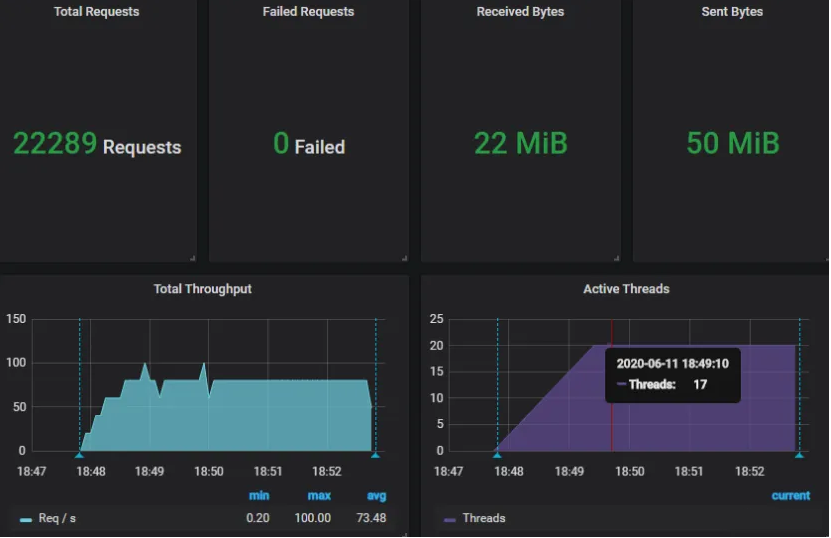
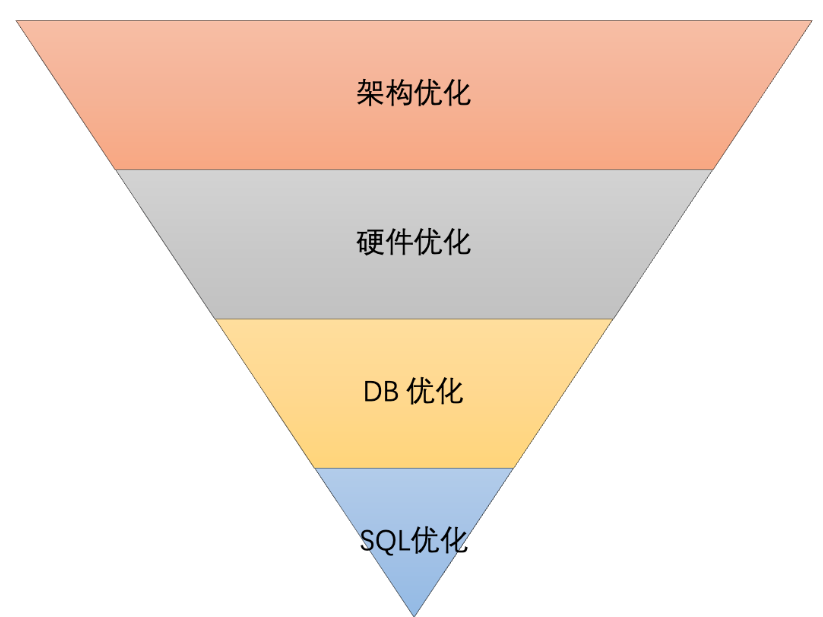

在现代的互联网应用中，随着用户量和访问量的不断增加，高并发成为了许多系统面临的巨大挑战。在这种高并发的场景下，数据库往往是系统瓶颈的所在，因为在多线程同时访问时，数据库的查询性能直接影响到系统的整体响应速度与稳定性。


因此，优化高并发场景下的数据库查询性能不仅是系统架构设计的重要一环，也是提升用户体验和系统可靠性的关键。

## 分析性能瓶颈
在高并发场景下，分析数据库查询的性能瓶颈是优化数据库性能的第一步。了解瓶颈所在能够帮助我们有针对性地采取优化措施，避免无效的优化。



### 1. 确定瓶颈的来源
首先，我们需要明确性能瓶颈出现在数据库的哪个层面，常见的性能瓶颈有以下几类：

+ **CPU瓶颈**：数据库操作大量计算密集型任务，导致CPU负载过高。
+ **内存瓶颈**：查询缓存、数据库缓存、连接池等导致内存占用过高。
+ **I/O瓶颈**：磁盘或网络带宽不足，导致数据读写速度缓慢。
+ **锁竞争**：高并发场景下数据库锁争用，导致线程等待，性能下降。
+ **查询效率低**：不合理的查询语句或缺乏合适索引导致查询响应时间长。

### 2. 监控数据库性能指标
要准确分析性能瓶颈，我们需要通过一些常见的数据库性能监控工具来获取实时的性能数据，常见的性能指标包括：

+ **查询响应时间**：每个查询的执行时间，过长的查询往往是瓶颈的一个标志。
+ **吞吐量**：单位时间内能处理的查询数，低吞吐量通常表示处理能力不足。
+ **数据库连接数**：高并发请求下，过多的数据库连接会增加上下文切换和连接池竞争，影响性能。
+ **锁等待时间**：锁竞争是高并发下常见的性能瓶颈，监控锁等待时间能帮助我们识别是否存在锁争用问题。
+ **慢查询日志**：记录超过预定时间的慢查询，分析哪些查询占用了较长的时间，找出潜在的性能问题。
+ **IOPS（Input/Output Operations Per Second）**：磁盘I/O操作次数，I/O操作过多可能是磁盘I/O瓶颈的指示。

### 3. 数据库执行计划分析
查询执行计划是分析SQL语句性能的一个重要工具。通过查看执行计划，我们可以了解数据库在执行某个查询时，如何访问数据，哪些步骤需要更多的时间。关键点包括：

+ **全表扫描**：没有索引的查询会导致全表扫描，增加数据库的负担。通过优化SQL语句或添加合适的索引可以避免全表扫描。
+ **索引使用情况**：执行计划中显示的索引使用情况是优化的关键。如果查询中未使用索引，或者使用了不合适的索引，我们需要调整查询或索引。
+ **连接操作**：多个表的连接操作，尤其是没有索引的连接，可能会导致查询效率低。查看连接顺序和条件可以帮助发现瓶颈。
+ **排序和聚合操作**：排序和聚合操作可能非常消耗计算资源，特别是在大数据量的情况下。

### 4. 数据库负载分析
高并发场景下，数据库负载的增加可能导致查询性能下降。可以通过以下方法进行负载分析：

+ **连接池分析**：监控数据库连接池的状态，查看连接池是否饱和，过多的连接请求可能导致连接池溢出或导致请求排队。
+ **查询等待分析**：分析查询等待时间，尤其是高并发下，可能有大量的查询在等待其他查询释放锁或资源，导致瓶颈。
+ **缓存命中率**：数据库的缓存命中率低也会增加I/O负担，导致查询慢。通过查看缓存命中率来确定是否需要调整数据库缓存配置。

### 5. 高并发场景下的并发控制与隔离级别
在高并发场景下，数据库的并发控制与隔离级别也是影响性能的关键因素。常见的影响点有：

+ **事务隔离级别**：较高的事务隔离级别（如串行化）会导致锁竞争和性能瓶颈，而较低的隔离级别（如读已提交）则可能导致脏读、不可重复读等问题。根据实际业务场景选择合适的隔离级别。
+ **锁的粒度**：行锁、表锁、页锁等不同粒度的锁会对并发性能产生不同的影响。过多的锁会导致等待时间过长，从而影响查询性能。

### 6. 分析具体查询的瓶颈
通过慢查询日志或执行计划分析具体的查询语句，找出哪些查询可能是性能瓶颈的主要原因。常见的优化方向有：

+ **索引优化**：通过创建合适的索引来提高查询速度，尤其是涉及大量数据量的查询。
+ **SQL重写**：通过重写SQL语句，避免不必要的子查询、联合查询和排序操作。
+ **分页查询**：对于大数据量的查询，避免一次性加载所有数据，使用分页查询减少数据库负载。

### 7. 分布式数据库分析
在分布式数据库环境下，性能瓶颈可能出现在以下几个方面：

+ **数据分片**：不合理的数据分片策略可能导致某些节点承载过重的查询请求，从而成为瓶颈。
+ **跨节点查询**：在多节点的数据库集群中，跨节点查询需要通过网络进行数据传输，这可能增加延迟。
+ **数据一致性**：分布式数据库的强一致性要求可能导致锁竞争和事务性能问题。

### 8. 硬件和网络性能分析
除了数据库本身，硬件和网络的性能也会影响查询效率。可以通过以下方法进行分析：

+ **CPU性能**：高并发查询时，CPU可能成为瓶颈，导致查询处理速度下降。
+ **内存带宽**：内存不足或带宽受限会影响数据库缓存的命中率，导致频繁的磁盘I/O操作。
+ **网络延迟**：分布式数据库查询过程中，网络延迟可能成为瓶颈，影响查询响应时间。

## 数据库架构优化
数据库架构优化是提升数据库性能、提高系统可扩展性和可维护性的关键。随着系统业务规模的不断增长，单一数据库往往无法满足高并发、高可用、高扩展性的需求，因此数据库架构优化至关重要。数据库架构优化的核心目标是减少系统瓶颈，提高响应速度，提升并发处理能力，并保证系统在大流量情况下的稳定性。



### 1. 数据库分库分表
#### 1.1 分库
在系统初期，单一数据库的架构可能能够满足业务需求，但随着业务增长，数据库性能可能会成为瓶颈。分库是通过将数据拆分到多个数据库实例中来提高并发和负载均衡。常见的分库方式有：

+ **垂直分库**：根据业务模块或表的功能划分，例如将用户表、订单表、支付表分到不同的数据库中。垂直分库适用于业务逻辑之间松耦合的场景。
+ **水平分库**：根据某个维度（例如用户ID或时间）将数据分散到多个数据库实例中。水平分库适用于数据量大且数据访问模式较为均匀的场景。例如，对于一个大数据量的订单表，可以根据用户ID将数据划分到不同的数据库中。

#### 1.2 分表
分表是指将单个表的数据拆分成多个表，以应对表的行数过多带来的性能问题。常见的分表方式有：

+ **水平分表**：根据某些列（如用户ID、时间戳等）对数据进行切割，使得每个子表存储一定范围的数据。
+ **垂直分表**：将表中的字段按业务功能拆分成多个子表，每个子表只存储部分字段。适用于表字段较多且不同字段访问频率差异较大的场景。

分库分表不仅能提高数据库的并发能力，还能通过分散数据来减少单个数据库的负担，从而提升数据库的扩展性与高可用性。

### 2. 数据库读写分离
#### 2.1 读写分离的架构
读写分离是将数据库的读操作和写操作分配到不同的数据库实例上。通常情况下，写操作对性能的影响较大，而读操作相对较轻，特别是在高并发的场景下，读操作会占据大量的数据库资源。为了减轻主库的压力，可以将写操作指向主库，将读操作指向多个只读的从库。

#### 2.2 负载均衡
读写分离可以与数据库负载均衡结合使用，通过在多个从库之间分配读取请求，提升系统的吞吐量。常见的负载均衡策略包括：

+ **轮询**：将请求平均分配到各个从库。
+ **加权轮询**：根据从库的负载情况调整请求分配的比例。
+ **读请求路由**：根据查询的复杂度，动态地将复杂查询请求分配到性能更强的从库。

通过读写分离，可以显著提高数据库的读性能，并避免主库在高并发下过载。

### 3. 数据库缓存优化
#### 3.1 使用缓存层
数据库缓存是优化数据库性能的一个重要手段。缓存通过在内存中存储热点数据，减少对数据库的重复查询请求，从而降低数据库的负载和响应时间。常见的缓存技术有：

+ **Redis**：高性能的内存缓存，可以缓存常用的查询结果，减少数据库的访问频率。
+ **Memcached**：也常用于缓存热点数据，尤其是数据访问频繁的场景。

缓存机制可以大幅度提高读取速度，尤其是对于热点数据，避免每次请求都访问数据库。但需要注意的是，缓存中的数据可能会与数据库中的数据不一致，需要设计合适的缓存更新策略。

#### 3.2 缓存穿透与缓存雪崩
在使用缓存时，必须考虑以下问题：

+ **缓存穿透**：即缓存中不存在的数据直接请求数据库，导致缓存无效。解决方案包括使用布隆过滤器来检查请求是否为合法数据，或者使用空值缓存。
+ **缓存雪崩**：大量缓存同时过期，导致大量请求直接访问数据库，造成数据库压力暴增。可以通过设置不同过期时间、使用分布式锁等方式来解决。

### 4. 数据库索引优化
#### 4.1 索引的作用
数据库索引可以提高查询性能，尤其是对于大表中的查询操作。合理的索引设计能够减少全表扫描，从而提高查询效率。常见的索引类型有：

+ **B树索引**：适用于范围查询、排序查询等。
+ **哈希索引**：适用于等值查询。
+ **全文索引**：适用于文本字段的全文检索。

#### 4.2 索引优化策略
+ **避免过度索引**：过多的索引会增加写操作的成本，并且不常用的索引可能会降低查询效率。
+ **联合索引**：对于多列的查询，可以考虑使用联合索引，避免多个单列索引的多次查询。
+ **覆盖索引**：在某些查询中，可以利用覆盖索引让查询在索引层就返回所有数据，减少了对表的访问。

通过合理设计索引，可以显著提高查询效率，但也需要权衡写操作的性能影响。

### 5. 数据库高可用与容错设计
#### 5.1 主从复制与高可用架构
数据库高可用性设计旨在保证系统在数据库故障时仍能继续运行。常见的高可用架构有：

+ **主从复制**：主数据库负责处理写操作，从数据库负责处理读操作。如果主数据库发生故障，可以自动切换到从数据库。
+ **Galera Cluster**：一个基于多主复制的高可用架构，支持自动故障转移和数据一致性保证。

#### 5.2 数据库备份与恢复
定期备份数据是保障系统可用性的关键措施。备份策略包括全量备份、增量备份和差异备份。此外，设计数据恢复机制能够在发生故障时及时恢复数据库。

### 6. 数据库水平扩展
#### 6.1 数据库分片
数据库分片是通过水平拆分数据，将数据分散到多个数据库节点上，能够有效提高系统的扩展性和可用性。分片方案的设计需要考虑数据分布、查询模式以及事务的一致性等问题。

#### 6.2 分布式数据库
分布式数据库如CockroachDB、TiDB等，提供了水平扩展的能力，并能够保证数据的强一致性，适用于分布式架构下的大规模数据存储需求。

### 7. 数据库查询优化
#### 7.1 查询语句优化
编写高效的SQL查询语句是数据库优化的基础。避免使用低效的查询语句（如全表扫描、子查询、N+1查询等），尽量使用JOIN、索引等优化技巧来加速查询。

#### 7.2 批量操作与分页查询
+ **批量操作**：批量插入、更新、删除可以减少与数据库的交互次数，提高性能。
+ **分页查询**：对于大数据量的查询，通过分页分批处理，避免一次性加载过多数据，减少数据库压力。

### 8. 数据库监控与调优
#### 8.1 数据库性能监控
监控数据库的各项指标（如查询响应时间、锁竞争、吞吐量等），能够帮助及时发现瓶颈并进行优化。常见的数据库监控工具有Prometheus、Grafana、Zabbix等。

#### 8.2 数据库调优
通过调整数据库的配置参数（如缓冲区大小、连接池配置、并发数限制等）来提升性能。例如，调整数据库连接池的最大连接数，避免连接池过载。

## 索引优化
索引是数据库中提升查询性能的重要工具，可以通过减少全表扫描、加速查询操作，从而显著提高数据库的性能。然而，过度使用索引或不合理的索引设计可能会导致性能问题。因此，索引优化是数据库优化过程中不可忽视的部分。

### 1. 索引的作用与原理
索引是一个数据结构，它通过在数据库中为指定字段创建一个快速查找的方式，减少查询时所需的扫描数据量。常见的索引类型包括：

+ **B树索引**：适用于范围查询和排序查询，它通过平衡树的结构确保查询效率。
+ **哈希索引**：适用于等值查询，哈希索引根据哈希函数将数据映射到特定位置，查询时速度极快。
+ **全文索引**：适用于全文检索，可以用来查找包含特定单词的文档或记录。
+ **位图索引**：适用于列值取值较少的场景，通过位图进行存储和查询，效率较高。
+ **空间索引**：用于地理数据、图形数据的查询，常见于GIS（地理信息系统）数据库中。

索引通过建立一个数据结构，减少数据扫描的范围或时间，从而提高查询效率。但它也有一些代价，主要体现在插入、删除和更新操作时需要额外的维护开销。

### 2. 索引优化策略
#### 2.1 合理选择索引字段
+ **选择查询条件字段**：应该为频繁出现在查询条件中的字段创建索引。例如，在WHERE子句、JOIN条件、ORDER BY或GROUP BY中经常使用的字段应该优先建立索引。
+ **选择选择性高的字段**：字段的选择性越高，索引的效果越好。选择性指的是字段中唯一值的比例。比如，ID、手机号等字段的选择性很高，适合建立索引，而性别、状态等字段选择性较低，索引效果可能不明显。
+ **避免低选择性字段建立索引**：例如，如果某个字段的值只有两三个不同的选项（如“男”和“女”），即使你在这个字段上建立索引，查询时也不会获得显著的性能提升，因为查询时会扫描大量重复的数据。

#### 2.2 选择合适的索引类型
+ **B树索引**：最常用的索引类型，适用于大部分的查询操作，包括范围查询、排序等。B树索引的优点是支持顺序访问，能够高效地处理范围查询。
+ **联合索引（复合索引）**：如果查询中涉及多个字段，并且这些字段经常一起出现在查询条件中，使用联合索引能够提高查询效率。联合索引的字段顺序要和查询中的字段顺序一致。
+ **覆盖索引**：当查询的列完全被索引覆盖时，查询性能会极大提高。覆盖索引指的是索引中包含了查询所需的所有列，查询可以通过索引直接返回结果，而无需访问数据表。

#### 2.3 避免过度索引
+ **过多索引的代价**：每添加一个索引，数据库就需要额外的存储空间并在插入、删除或更新数据时维护索引。因此，过多的索引会对写操作（插入、删除、更新）产生较大的负担。
+ **删除不必要的索引**：需要定期审查和删除不再使用的索引，避免索引积压带来的性能损耗。

#### 2.4 联合索引的顺序优化
联合索引在创建时，字段的顺序对查询性能有重要影响。联合索引的顺序应该根据查询条件的使用频率来决定。一般来说，查询条件中最常用的字段应该放在联合索引的最前面。例如：

```sql
CREATE INDEX idx_user_order ON orders (user_id, order_date, order_status);
```

在这个联合索引中，`user_id`字段应该是最常用的查询条件字段，因此应该放在最前面。如果你经常根据`order_status`来查询，可以考虑将其放在索引的前面。

#### 2.5 避免使用过多的LIKE模糊查询
LIKE查询经常用于模糊匹配，然而，如果使用“%”通配符放在查询条件的前面（如`LIKE '%text'`），则无法利用索引。为了优化这种情况，可以考虑：

+ **避免以“%”开头的LIKE查询**：如果可能，避免在查询条件中使用“%”通配符，或者将“%”放在查询条件的末尾（如`LIKE 'text%'`），这样可以利用索引进行匹配。
+ **全文索引**：对于更复杂的文本匹配，可以考虑使用全文索引（Full-text Index）。

#### 2.6 适当调整表设计与查询模式
+ **表设计与规范化**：数据库表的设计对索引优化有重要影响。保持数据库表的规范化程度，同时避免过度规范化带来的关联查询过多。合理的表设计可以减少不必要的JOIN操作。
+ **批量查询**：对于频繁的查询操作，如果涉及多个值的匹配，使用IN代替多次的OR查询，以提高索引利用率。例如：

```sql
SELECT * FROM orders WHERE user_id IN (1, 2, 3);
```

+ **分表分库**：对于非常大的表，可以考虑分表分库，减少单表查询的数据量，从而提高索引效率。

### 3. 索引优化的常见问题与解决方案
#### 3.1 索引失效
索引失效是指查询优化器无法利用索引来加速查询，常见的原因有：

+ 使用了不支持索引的操作（如`LIKE '%value%'`）。
+ 在查询中进行隐式类型转换（例如`WHERE price = '10'`，但`price`字段是数字类型）。
+ 在索引字段上进行了运算或函数操作（例如`WHERE YEAR(date) = 2021`，此时索引失效）。

**解决方案**：避免使用不支持索引的操作、避免隐式类型转换、避免在索引字段上进行运算。

#### 3.2 查询性能不佳
有时即便有索引，查询的性能依然不理想。这可能是因为查询中的其他因素影响了索引的有效性。可以通过执行计划（`EXPLAIN`）来分析查询，并确认数据库是否正确使用了索引。

**解决方案**：使用`EXPLAIN`查看查询的执行计划，确保数据库使用了合适的索引。如果没有，调整索引设计或修改查询语句。

### 4. 索引的维护与监控
+ **定期检查索引使用情况**：通过数据库的索引监控功能，检查哪些索引被频繁使用，哪些索引未被使用。可以考虑删除无用索引。
+ **重新构建索引**：随着数据的不断增加，索引可能会变得不再高效。可以定期进行索引重建或重新组织，以优化性能。

## 优化查询语句
在数据库性能优化中，查询语句的优化至关重要。优化不当的查询语句可以导致数据库执行不必要的操作，造成性能瓶颈，影响系统的响应速度和并发处理能力。为了提高数据库查询的效率，需要深入分析和改进查询语句的执行方式、访问模式以及如何与数据库中的索引和表结构配合。

### 1. 查询语句优化的基本原则
优化查询语句的目标是减少数据库的计算负担、减少IO操作、尽可能减少查询时间。以下是优化查询语句的基本原则：

+ **避免全表扫描**：全表扫描是一种高开销操作，应尽量避免。
+ **减少查询的数据量**：仅查询需要的数据，避免返回过多的无用数据。
+ **减少查询的次数**：通过批量查询或减少多次查询操作，减少数据库负载。
+ **优化JOIN操作**：减少不必要的JOIN操作，优化JOIN的顺序和方式。
+ **选择合适的查询字段**：避免使用SELECT *，仅返回必要的字段。

### 2. 避免不必要的全表扫描
全表扫描通常会导致查询性能大幅下降。为了避免全表扫描，可以：

+ **使用索引**：确保查询条件字段上有适当的索引。这样，查询时数据库可以通过索引快速定位相关记录，而不是扫描整个表。
+ **避免不必要的WHERE条件**：避免使用过于宽泛的条件，尽量将查询条件限定在小范围内。
+ **避免不必要的复杂计算**：查询条件中如果包含了复杂计算（如`WHERE YEAR(date) = 2021`），数据库将无法利用索引。可以在查询时避免使用计算或函数，或者通过提前处理数据来避免计算。

### 3. 减少返回的数据量
返回的数据量越多，查询的时间和I/O消耗越大。为了减少返回的数据量，可以：

+ *_避免SELECT __查询_：`SELECT *`会返回表中的所有列，而实际上我们往往只关心部分字段。通过只查询需要的字段来减少返回的数据量。

```sql
-- 不推荐
SELECT * FROM orders WHERE user_id = 123;

-- 推荐
SELECT order_id, order_date, order_status FROM orders WHERE user_id = 123;
```

+ **使用LIMIT限制返回数据量**：如果仅需要查询前几个结果，可以使用`LIMIT`来限制返回的行数，减少查询时的资源消耗。

```sql
SELECT * FROM orders ORDER BY order_date DESC LIMIT 10;
```

+ **合理分页**：对于返回大量数据的查询，可以通过分页来避免一次性查询过多数据，减轻数据库负担。

### 4. 优化JOIN操作
JOIN操作通常是查询中的性能瓶颈，尤其在涉及多个大表时，优化JOIN是至关重要的。以下是一些优化JOIN操作的策略：

+ **选择合适的JOIN类型**：不同的JOIN类型会对查询性能产生不同影响。例如，`INNER JOIN`通常比`OUTER JOIN`执行更快。只有在必要时使用`LEFT JOIN`、`RIGHT JOIN`等外连接类型。
+ **优化JOIN的顺序**：数据库在执行JOIN时，通常会选择最优的JOIN顺序。然而，在某些复杂查询中，我们可以通过调整JOIN顺序或子查询的方式来优化性能。

```sql
-- 示例：在JOIN操作中优先查询小表
SELECT * FROM large_table lt
INNER JOIN small_table st ON lt.id = st.id;
```

+ **避免多次JOIN**：尽量减少不必要的JOIN操作。如果查询结果已经可以通过其他方式获得，避免多次JOIN查询。例如，在多表关联查询时，可以考虑使用子查询或临时表来减少JOIN次数。

### 5. 使用子查询与临时表
有时，将复杂查询分解为多个子查询或使用临时表可以提高查询性能。子查询可以减少重复计算，而临时表可以将中间结果存储在内存中，从而提高查询效率。

+ **使用子查询**：将某些复杂的计算或筛选操作放入子查询中，避免重复计算。例如：

```sql
SELECT user_id, SUM(order_amount)
FROM orders
WHERE user_id IN (SELECT user_id FROM users WHERE user_status = 'active')
GROUP BY user_id;
```

+ **使用临时表**：对于非常复杂的查询，可以将中间计算结果存储在临时表中，然后对临时表进行查询操作。

```sql
CREATE TEMPORARY TABLE tmp_orders AS
SELECT order_id, user_id, order_amount FROM orders WHERE order_date > '2024-01-01';

SELECT user_id, SUM(order_amount) FROM tmp_orders GROUP BY user_id;
```

### 6. 索引优化与查询匹配
优化查询时，应当确保索引与查询语句的结构匹配。以下是一些索引优化的建议：

+ **合适的索引字段选择**：确保在查询条件中经常出现的字段（如`WHERE`、`JOIN`、`ORDER BY`等条件）上有索引。

```sql
CREATE INDEX idx_user_id ON orders(user_id);
```

+ **避免过多的索引**：虽然索引可以加速查询，但过多的索引会降低插入、更新和删除操作的性能，因此需要根据实际查询情况精简索引。
+ **使用联合索引**：当查询需要多个字段组合时，可以使用联合索引来加速查询。

```sql
CREATE INDEX idx_user_order ON orders(user_id, order_status);
```

### 7. 避免使用不必要的ORDER BY
`ORDER BY`会让数据库在查询结果排序，这在数据量大时会非常耗时。若业务场景并不需要排序结果，尽量避免使用`ORDER BY`。如果确实需要排序，可以考虑：

+ **索引优化**：通过为排序字段添加索引来提高排序效率。
+ **分页查询**：对于大数据量的排序，结合`LIMIT`进行分页查询，避免一次性加载所有排序结果。

### 8. 其他优化技巧
+ **合理使用缓存**：对于频繁查询的数据，使用缓存机制（如Redis、Memcached）来减轻数据库负担，提高响应速度。
+ **避免死锁**：确保数据库事务的顺序一致，避免多个查询相互锁定导致死锁。
+ **数据库连接池优化**：确保数据库连接池配置合理，避免连接池资源的浪费和过度占用。

## 数据缓存
数据缓存是一种优化技术，通过在内存中存储数据的副本，减少从数据库或其他数据源加载数据的次数，从而提高应用程序的响应速度和系统的整体性能。在高并发、高负载的场景下，合理使用缓存可以显著减轻数据库压力，提升系统吞吐量，并有效降低延迟。

### 1. 缓存的基本概念
缓存是一种将数据存储在快速存取的存储介质（如内存）中的技术。缓存的目的是避免频繁访问较慢的存储设备（如磁盘数据库），通过提供一个临时存储区域来加速数据读取。

在分布式系统中，缓存可以存在多个层次，主要包括：

+ **本地缓存**：每个服务实例独立管理自己的缓存，例如应用程序内部使用的内存缓存（如`HashMap`、`Guava Cache`等）。
+ **分布式缓存**：缓存数据被多个节点共享，适用于多个服务需要访问相同的数据，如`Redis`、`Memcached`、`Ehcache`等。

### 2. 缓存的作用
缓存的主要作用是减少系统访问低速存储（如数据库）的次数，从而提高系统性能。具体而言，缓存可以带来以下好处：

+ **提高性能**：通过减少访问数据库或外部服务的次数，缓存可以显著提高应用程序的响应速度。
+ **降低数据库负载**：频繁的数据库查询会增加数据库的压力，缓存可以减轻这一负担，避免数据库成为性能瓶颈。
+ **减少延迟**：访问内存中的缓存比访问磁盘或远程服务要快得多，可以减少响应延迟。
+ **减少成本**：缓存可以减少对后端数据库的访问，从而降低对数据库的硬件要求和运维成本。

### 3. 缓存的类型
缓存可以分为多种类型，常见的有：

+ **写通过缓存（Write-through Cache）**：数据在写入缓存的同时也会写入底层存储（如数据库）。当缓存中的数据发生变化时，底层存储的数据会同步更新。
  - 优点：保证数据一致性，确保缓存和底层存储的数据始终保持同步。
  - 缺点：写操作性能较差，因为每次写操作都需要同步底层存储。
+ **写回缓存（Write-back Cache）**：数据首先写入缓存，只有当缓存中的数据被替换或清除时，才会同步更新到底层存储。
  - 优点：提高写操作的性能。
  - 缺点：数据可能会存在短时间的不一致性问题，可能导致缓存数据丢失的风险。
+ **只读缓存（Read-through Cache）**：当缓存中不存在请求的数据时，会从底层存储加载数据，并将数据存入缓存中。该模式适用于只读数据，或读取远大于写入的场景。
  - 优点：缓存中总是存在最新的数据，读操作非常高效。
  - 缺点：对于需要更新的数据，可能导致缓存和数据库间的数据不同步。
+ **过期缓存（Expiration Cache）**：缓存中的数据有一个生命周期，缓存数据会根据时间或访问次数过期。过期后，数据会从缓存中删除，重新从底层存储加载。
  - 优点：通过设置适当的过期时间，可以有效管理缓存空间，防止缓存数据不及时更新。
  - 缺点：可能存在缓存未更新及时的情况，导致读取到过期的数据。

### 4. 缓存的常见实现
+ **本地缓存**：通常在单机应用或小规模服务中使用。常见的本地缓存实现包括：
  - **Java的**`HashMap`：简单易用，但不具备分布式特性和过期策略。
  - **Guava Cache**：Google提供的Java缓存库，支持自动过期、大小限制等功能。
  - **Caffeine**：一种高效的Java缓存库，支持基于容量和时间的缓存管理，适用于高并发场景。
+ **分布式缓存**：适用于多台机器共享缓存数据的场景，常见的分布式缓存有：
  - **Redis**：高性能的键值存储数据库，广泛用于分布式缓存、消息队列等场景。支持多种数据结构（如字符串、哈希、列表等），并提供持久化机制。
  - **Memcached**：一个开源、高性能的分布式内存对象缓存系统，适用于缓存存储结构较简单的场景。
  - **Hazelcast**：分布式缓存和计算平台，支持高可用、分布式的缓存和数据存储。

### 5. 缓存穿透、缓存雪崩、缓存击穿问题
+ **缓存穿透**：缓存和数据库都没有数据，导致请求直接穿透缓存层访问数据库，增加数据库压力。通常通过：
  - **使用Bloom Filter**：预防一些不存在的数据查询直接访问数据库。
  - **缓存空值**：对于不存在的数据，可以在缓存中存储一个空值（如`null`），避免重复访问底层存储。
+ **缓存雪崩**：缓存中大量数据过期，同时访问大量数据，导致大量请求直接访问数据库，造成数据库负担过重。解决方法包括：
  - **加随机过期时间**：不同缓存数据设置不同的过期时间，避免大量数据同时过期。
  - **使用互斥锁**：避免多个请求同时查询缓存失效的数据。
+ **缓存击穿**：某个热点数据的缓存过期，导致大量请求直接访问数据库，给数据库带来巨大压力。解决方法包括：
  - **使用互斥锁**：对于缓存失效的数据，使用锁机制保证只有一个请求会去查询底层存储，其他请求等待查询结果。
  - **使用双重检查锁**：先检查缓存是否存在数据，如果不存在再加锁查询。

### 6. 缓存失效与更新策略
+ **主动失效**：在数据更新时主动更新缓存数据，确保缓存数据是最新的。例如，在更新数据库时，主动删除相关缓存条目或更新缓存中的数据。
+ **被动失效**：当缓存数据过期或被清除时，才重新加载缓存。这种方式简单，但可能会导致短时间内的数据不一致性。
+ **定时刷新**：定时更新缓存中的数据。适用于对实时性要求不高的场景。

### 7. 缓存的应用场景
+ **热点数据缓存**：对于查询频繁且变化较小的数据，缓存可以显著提升访问速度。例如，用户信息、商品列表等。
+ **查询结果缓存**：对于复杂的数据库查询，可以将查询结果缓存起来，避免重复执行同样的查询操作，减轻数据库压力。
+ **频繁调用的API缓存**：对于高频调用的接口，可以通过缓存API响应来提高性能。例如，天气数据、汇率信息等。
+ **Session缓存**：缓存用户的会话信息，减少数据库或其他存储的查询次数，提升用户体验。

## 数据库连接优化
数据库连接优化是提升数据库性能和系统吞吐量的关键手段之一。在高并发的场景下，数据库连接的创建、使用和释放成为性能瓶颈。有效的数据库连接优化不仅能显著降低延迟和提高响应速度，还能减少数据库资源的消耗，提升系统的可扩展性和稳定性。

### 1. 数据库连接池
数据库连接池是优化数据库连接性能的核心机制。它通过复用已有的数据库连接来避免频繁创建和销毁连接的开销，提高了数据库连接的利用率。

+ **数据库连接池的工作原理**：数据库连接池维护了一组连接对象，当应用程序需要访问数据库时，从连接池中获取空闲连接。使用完毕后，连接并不会关闭，而是归还到池中等待下一次使用。这样可以显著减少连接的创建和销毁开销，提升系统性能。常见的数据库连接池有：
  - **HikariCP**：一个高性能的JDBC连接池，被广泛使用，具有较低的延迟和较高的吞吐量。
  - **C3P0**：支持多种高级功能，如自动重连、动态扩展等，适用于较复杂的数据库连接管理。
  - **DBCP**：Apache的数据库连接池实现，适用于高并发场景。
  - **BoneCP**：一个高效的连接池实现，适用于处理高负载的情况。

### 2. 合理配置连接池参数
数据库连接池的性能与其配置息息相关，合理配置连接池的参数可以显著提升系统的性能和资源利用率。

+ **最大连接数（maxTotal/maxActive）**：这是连接池中最大的连接数，设置过低会导致连接不够用，造成等待；设置过高会增加数据库负载，影响性能。需要根据应用的并发量、数据库性能及硬件资源进行调整。
+ **最小连接数（minIdle）**：连接池中维持的最小空闲连接数。设置过小可能会导致频繁创建和销毁连接，增加延迟；设置过大则会浪费资源。可以根据应用的业务需求进行调整。
+ **连接池的最大等待时间（maxWait）**：当连接池中没有空闲连接时，获取连接的最大等待时间。需要根据应用的响应时间要求设置一个合理的等待时间，以避免请求阻塞。
+ **连接测试和回收（testOnBorrow、testOnReturn、testWhileIdle）**：连接池可以通过一定策略测试连接是否有效。设置合适的测试策略，防止因连接断开或过期导致异常，保证系统的稳定性。
+ **最大空闲时间（maxIdle）**：连接池中空闲连接的最大保持时间。如果连接池中有太多空闲连接，可以设置最大空闲时间来回收过期的连接，避免资源浪费。

### 3. 长连接 vs 短连接
在设计数据库连接策略时，可以根据应用的特点选择使用长连接或短连接：

+ **长连接**：在数据库连接池中保持长期的连接，适用于高并发、长时间运行的业务场景。长连接的优势在于可以减少每次操作时的连接创建和销毁开销，适用于连接保持时间较长的任务。
+ **短连接**：每次数据库操作完成后立即关闭连接，适用于频繁的短时任务。短连接的优点是资源释放较快，但连接的建立和关闭开销较大。在高并发时，频繁的连接和关闭操作会导致性能下降，因此需要通过连接池来优化。

### 4. 数据库连接复用与多线程处理
在高并发系统中，合理的数据库连接复用与线程管理是提高性能的关键：

+ **数据库连接复用**：通过使用连接池，避免了每次访问数据库时都需要新建连接，减少了连接创建和销毁的开销。连接池会自动管理连接的分配与释放，提供高效的连接复用机制。
+ **线程池管理**：在高并发场景下，数据库访问通常由多个线程并发执行，因此使用线程池来管理数据库请求是非常必要的。线程池可以有效控制并发请求的数量，避免线程过多导致的资源竞争和性能下降。

### 5. 批量操作与事务控制
批量操作可以有效减少数据库连接的占用时间，并提高数据库的吞吐量。

+ **批量插入/更新**：通过使用批处理技术（如JDBC的批量插入操作），可以将多个单独的数据库操作合并为一个批处理请求，从而减少数据库交互的次数，提升性能。大多数连接池和ORM框架（如MyBatis）都支持批量操作。
+ **事务控制**：在高并发环境中，使用数据库事务可以确保操作的原子性和一致性。合理的事务粒度可以减少事务的锁竞争，提高并发度。对于不需要严格一致性的操作，可以考虑使用**最终一致性**模型，避免过度的事务锁定。

### 6. 数据库连接池监控与性能分析
数据库连接池的性能需要通过监控工具进行实时跟踪和调整。通过分析数据库连接的使用情况，可以了解瓶颈和资源消耗，并对连接池的配置进行优化。

+ **数据库连接池监控**：通过监控连接池的使用情况，实时了解连接池的当前状态（如当前活跃连接数、空闲连接数、最大连接数等）。常见的数据库连接池监控工具包括：
  - **JMX监控**：通过Java Management Extensions（JMX）可以监控连接池的健康状况和性能。
  - **Prometheus + Grafana**：通过Prometheus收集连接池的指标数据，并通过Grafana展示实时的性能图表。
+ **数据库查询分析**：使用**数据库慢查询日志**和**SQL执行计划**分析来识别可能的性能瓶颈，优化SQL查询语句，从而减少对数据库连接的需求。

### 7. 限制数据库连接数与负载均衡
为了避免过度的数据库连接压力，限制每个应用实例能够同时打开的最大数据库连接数非常重要。可以通过以下方法来优化数据库连接的使用：

+ **应用实例负载均衡**：在分布式系统中，可以通过负载均衡将请求均匀分配到多个数据库实例上，从而降低每个数据库实例的负载，避免数据库连接的集中压力。
+ **数据库连接数限制**：在数据库连接池中设置最大连接数限制，防止连接池耗尽数据库资源，从而导致数据库服务崩溃。

### 8. 连接泄漏的防范
连接泄漏是指在使用完数据库连接后没有及时关闭，导致连接池中的连接被耗尽。为防止这种情况发生，通常可以采取以下策略：

+ **使用**`try-with-resources`：使用Java的`try-with-resources`语法来自动关闭数据库连接，避免忘记释放连接。
+ **连接池监控和报警**：通过监控数据库连接池的活动，及时发现连接泄漏，并采取措施进行恢复。

## 事务与锁优化
在高并发的数据库系统中，事务与锁的管理直接影响到系统的性能与可扩展性。事务和锁确保数据的一致性和完整性，但如果使用不当，它们也会成为性能瓶颈。优化事务和锁的使用是高并发环境下数据库优化的核心内容之一。

### 1. 事务的优化
事务确保数据库操作的原子性、一致性、隔离性和持久性（ACID特性），但过度使用事务或事务控制不当可能会导致性能问题。因此，合理设计事务可以大幅度提升系统的性能。

#### 1.1 减少事务的粒度
事务的粒度越大，数据库锁的持有时间越长，可能会导致死锁、阻塞或性能瓶颈。因此，事务粒度应尽量缩小，确保事务尽早提交，避免长时间持有锁。

+ **将长时间操作分解为多个小事务**：对于复杂的操作，可以考虑将其分解为多个小事务，尽早提交，以减少锁的持有时间。
+ **避免在事务中做不必要的操作**：如日志记录、耗时计算等操作，尽量避免在事务中进行，因为这些操作会增加事务的执行时间，延迟锁的释放。

#### 1.2 合理控制事务的隔离级别
数据库事务的隔离级别控制了事务之间的可见性和并发性。较高的隔离级别通常意味着更严格的锁控制，但也会增加性能开销。常见的事务隔离级别有：

+ **READ UNCOMMITTED（读取未提交）**：最低的隔离级别，允许脏读，但性能最好。适用于数据一致性要求不高的场景。
+ **READ COMMITTED（读取已提交）**：保证不读取未提交的数据，解决了脏读问题，性能较好，但可能会出现不可重复读的问题。
+ **REPEATABLE READ（可重复读）**：保证事务内的读取数据一致性，防止不可重复读，但可能会产生幻读。
+ **SERIALIZABLE（可串行化）**：最高的隔离级别，防止脏读、不可重复读和幻读，但性能最差。

在高并发的环境中，通常使用**READ COMMITTED**或**REPEATABLE READ**，以平衡一致性和性能。在某些低一致性要求的场景中，可以使用**READ UNCOMMITTED**。

#### 1.3 使用合适的事务提交方式
事务提交方式有两种：**自动提交**和**显式提交**。

+ **自动提交**：每次执行一个SQL语句后自动提交事务。对于简单的查询操作可以使用自动提交，但在复杂的事务操作中，自动提交会导致不必要的频繁提交，影响性能。
+ **显式提交**：手动控制事务的提交时机，能够在操作完成后统一提交事务，减少提交次数，适用于需要多个操作保证原子性和一致性的场景。

在高并发场景下，建议使用显式提交，避免频繁的自动提交带来的性能问题。

### 2. 锁的优化
锁是为了保证数据的一致性和完整性而在数据库中进行的同步操作，但锁的使用不当会导致性能瓶颈。锁的优化主要从**锁粒度、锁策略、死锁防范和非阻塞性操作**等方面进行优化。

#### 2.1 锁粒度优化
锁粒度越大，锁的竞争越激烈，系统的吞吐量就越低。因此，优化锁粒度是提升性能的关键。

+ **行级锁**：行级锁是锁定数据库表中的单行数据，它对并发操作影响较小，适合高并发的系统。但行级锁通常需要更复杂的管理和更多的锁开销，可能导致死锁。
+ **表级锁**：表级锁是锁定整个数据表，适用于大规模数据变更的场景，性能较好，但可能会导致较高的锁竞争，影响并发性能。应尽量避免在高并发的环境中使用。
+ **乐观锁与悲观锁**：悲观锁是通过显式地锁定数据来避免数据冲突，适用于高并发冲突的场景，但性能开销较大。乐观锁则在更新数据时，不加锁，而是在提交时通过版本号等机制判断数据是否被修改，适合冲突较少的场景。

#### 2.2 锁的类型和优化
+ **悲观锁**：悲观锁是对数据进行加锁，以保证操作的安全性，通常使用`SELECT FOR UPDATE`语句来加锁。对于高并发的系统，如果事务持有锁的时间过长，会导致其他事务被阻塞，影响性能。因此，使用悲观锁时，应该尽量减少锁的持有时间。
+ **乐观锁**：乐观锁基于**版本号**或**时间戳**机制，允许在事务提交前并发读取数据，并在提交时验证数据是否被其他事务修改。乐观锁通常使用`CAS（Compare And Swap）`机制，适用于低冲突的高并发场景。
+ **行级锁 vs 表级锁**：行级锁的粒度较细，对并发性能影响较小，但由于需要管理更多的锁，开销较大。表级锁的粒度较粗，但对于一些批量操作的场景，其性能较好。根据具体的业务场景和数据访问模式选择合适的锁类型。

#### 2.3 死锁预防与检测
死锁是指多个事务之间因为资源竞争相互等待，形成的循环依赖。死锁会导致系统性能下降，甚至崩溃。防止死锁的方法包括：

+ **事务顺序一致性**：确保多个事务按照相同的顺序访问共享资源，可以有效避免死锁。
+ **死锁检测机制**：一些数据库提供死锁检测机制，可以在检测到死锁时自动回滚某些事务，以解除死锁。
+ **设置超时机制**：为每个事务设置合理的超时时间，一旦超过限制时间还未完成，自动回滚事务，从而避免死锁。

#### 2.4 非阻塞性操作
非阻塞性操作是指通过异步和并发操作来避免数据库阻塞，提高系统的并发性。

+ **异步操作**：通过异步机制处理数据库操作，不阻塞当前线程，从而提高系统的吞吐量和响应速度。异步操作可以配合消息队列等技术使用，将繁重的数据库操作放入后台处理。
+ **无锁并发数据结构**：在一些特殊场景下，可以通过无锁的并发数据结构（如`ConcurrentHashMap`、`CAS`操作等）来避免锁竞争，提高性能。
